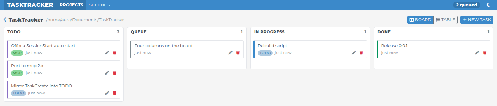
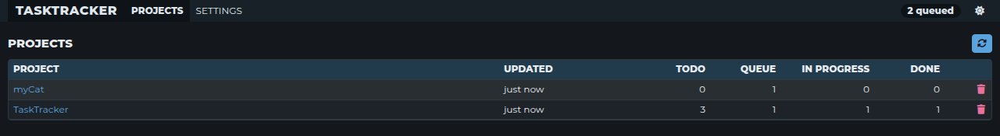
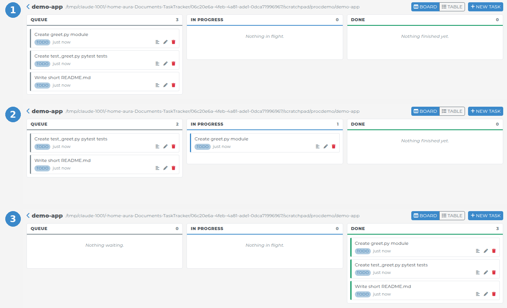
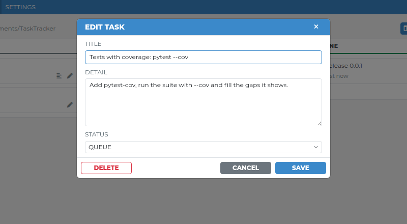
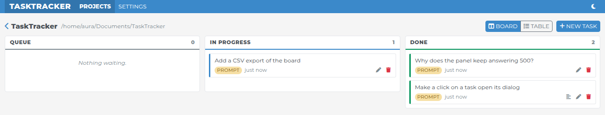

[EN](../README.md) | RU | [CN](README_CN.md)

## TaskTracker: доска, которую Claude Code и Codex заполняют сами 🗂️

<p class="badges">
  
  
  
  
  
</p>

Claude Code ведёт список задач, пока работает, — и этот список умирает вместе с сессией.<br>
TaskTracker зеркалит его на доску проекта и даёт Claude MCP-инструменты, чтобы в следующий раз прочитать очередь обратно.<br>
Доска — это веб-панель: список проектов, а внутри три колонки — **QUEUE**, **IN PROGRESS**, **DONE**.<br>
Проект появляется, как только ты запускаешь в нём Claude; панель обновляется сама.

**Codex тоже поддерживается:** его встроенный план зеркалится через хуки,
а очередь доступна через тот же MCP-сервер. См. [подключение Codex](#-codex).





Как это выглядит — настоящая сессия Claude Code, панель ни разу не перезагружалась: Claude
планирует работу, и задачи попадают в **QUEUE** (1); каждая переходит в **IN PROGRESS** до того,
как Claude за неё берётся (2), и в **DONE**, когда она готова (3).



Клик по задаче — карточке на доске или строке в таблице — открывает её: можно поправить
заголовок и описание, сменить статус или удалить задачу. Карточки можно и перетаскивать
между колонками.



## 🚀 Быстрый старт

**1. Запусти доску** — панель и MCP-сервер в одном контейнере:

```bash
cd TaskTracker
docker compose up -d
```

Панель откроется на http://127.0.0.1:8787. Откуда берутся карточки, задаётся в `.env` —
см. [ниже](#-откуда-берутся-карточки).

**2. Установи плагин Claude Code** — один раз, из той же папки; он работает во всех проектах.
Для Codex используй [отдельные шаги](#-codex):

```bash
claude plugin marketplace add ./
claude plugin install tasktracker@tasktracker
```

**3. Перезапусти Claude Code.** С этого момента каждый проект, где ты открываешь Claude,
есть на доске, а его карточки следуют за работой Claude.

**4. Проверь, что работает** — в Claude Code:

- `/mcp` — в списке есть `plugin:tasktracker:tasktracker` со статусом «подключён».
- `/tasktracker:tasks` — Claude показывает очередь текущего проекта (на новой доске она пустая).
- Попроси Claude *«составь todo-список из трёх шагов для …»* и открой http://127.0.0.1:8787 —
  там появится проект с тремя карточками с пометкой `TODO`.

**Обновление** — после получения изменений, из папки TaskTracker:

```bash
docker compose up -d --build
claude plugin marketplace update tasktracker
claude plugin uninstall tasktracker@tasktracker
claude plugin install tasktracker@tasktracker
```

Потом перезапусти Claude Code.

## 🤖 Codex

После запуска доски выполни из папки проекта (на хосте нужен Python 3.11+;
Linux, macOS или WSL):

```bash
codex mcp add tasktracker --url http://127.0.0.1:8787/mcp
python3 hooks/install-codex.py
```

Перезапусти Codex, открой `/hooks`, проверь и разреши хуки TaskTracker: Codex
требует этого перед их запуском. В `/mcp` проверь подключение сервера.
Установщик сохраняет другие хуки и делает резервную копию изменённого `hooks.json`.

При `TASKTRACKER_CARDS=claude` (прежнее значение по умолчанию, общее для обоих
клиентов) шаги `update_plan` становятся карточками `CODEX` и следуют их статусам.
При `TASKTRACKER_CARDS=prompts` запрос находится в IN PROGRESS, пока Codex отвечает,
а затем в DONE. Доска общая для Claude и Codex, сессии не меняют карточки друг друга.

После обновления пересобери контейнер, повтори установку хуков и перезапусти Codex.
[Полная инструкция, проверка и ограничения](CODEX.md).

## 🃏 Откуда берутся карточки

Одна настройка, `TASKTRACKER_CARDS` в `.env` рядом с `docker-compose.yml`
(скопируй [`.env.example`](../.env.example)). После смены — пересобери и перезапусти Claude Code.

```bash
TASKTRACKER_CARDS=claude    # по умолчанию
TASKTRACKER_CARDS=prompts
```

- **`claude`** — карточки — это задачи самого Claude. Плагин говорит Claude — в начале каждой
  сессии и ещё раз с каждым запросом — расписывать любую работу больше чем в один шаг задачами
  и вести их статусы; каждая задача — карточка с пометкой `TODO`, которая движется вместе с
  работой Claude. Если Claude всё же поработал — Bash, Edit, Write — не заведя ни одной задачи,
  сам запрос ложится в **DONE** с пометкой `PROMPT`. Вопрос, на который он ответил чтением,
  карточки не создаёт.
- **`prompts`** — каждый твой запрос — карточка с пометкой `PROMPT`: первая строка — заголовок,
  весь текст — описание. Она в **IN PROGRESS**, пока Claude отвечает, и в **DONE**, когда он
  закончил. Слэш-команды карточек не создают, задачи самого Claude не показываются.



## 🔗 Объединение дублей

Claude/Codex сравнивает смысл карточек через `tasks_review` и применяет решения
через `tasks_reconcile`. Например, промпт «давай 0.0.2» и MCP-задача «Release
0.0.2» могут стать одной карточкой. Разные подзадачи, релизы и сомнительные
совпадения остаются раздельными.

После работы хук Stop запрашивает одну сверку, если карточки из разных источников
изменились. В сверку попадают и DONE. На объединённой карточке видны все источники;
в разделе **MERGED CARDS** её диалога сохранены оригиналы и причина объединения.
Повторные хуки обращаются к той же карточке. Завершённый ответ на промпт сам по
себе не делает незавершённую задачу выполненной.

Для уже накопленных дублей запусти `/tasktracker:reconcile` в Claude Code или
попроси Codex сверить и объединить дубли TaskTracker в текущем проекте.
Сначала обнови контейнер и установленные хуки.
[Как работает сверка через LLM](RECONCILIATION.md).

## 🧪 Разработка

```bash
pip install -e '.[dev]'
pre-commit install              # ruff и тесты перед каждым коммитом
pytest --cov                    # тесты с покрытием и списком непокрытых строк
```

`ruff check` и `ruff format` держат стиль; настройки — в `pyproject.toml`.
GitHub Actions (`.github/workflows/ci.yml`) запускает ruff и `pytest --cov` на Python 3.11 и
3.12 для каждого pull request и каждого push в `main`.

У панели нет шага сборки: `src/tasktracker/www` отдаётся как есть, все библиотеки лежат там же.
Версия остаётся **0.0.2** до следующего релиза — почему и как изменение доходит до установленного плагина,
написано в [`CLAUDE.md`](../CLAUDE.md).

### Лицензия

[MIT](../LICENSE). Montserrat — под [SIL Open Font License](../src/tasktracker/www/fonts/OFL.txt).
